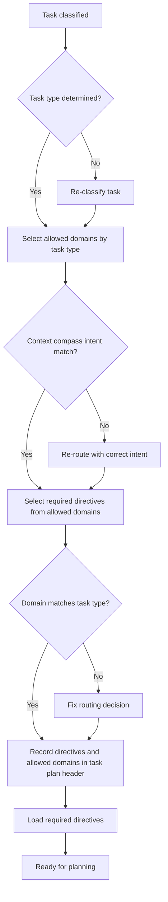

# Routing Model (Reference)

**Status**: Stable
**Date**: 2026-01-13
**Purpose**: Defines the routing model and virtual sub-agent boundaries.

---

## 1. Definition
Routing selects the required directives and allowed domains for a task.
Routing must be explicit and recorded in the task plan header.

> **Note:** This diagram is supplementary. The authoritative contract is in Section 1: Definition above. See `docs/reference/agentos/routing.md#1-definition` for complete requirements.

## 2. Roles
- **Root Orchestrator**: routes by task type and domain.
- **Domain Sub-Agent (virtual)**: executes within scoped directives and tools.

## 3. Handoff protocol
1. Orchestrator classifies task and selects domain.
2. Orchestrator loads the domain directives and tools.
3. Domain sub-agent executes within scope.
4. If another domain is required, the orchestrator re-routes and repeats.

## 4. Boundaries
- **Docs**: only domain directives are loaded.
- **Files**: only domain files are modified.
- **Tools**: only domain execution tools are used.
- **Doc types**: must follow `docs/reference/agentos/context-compass.md`.

## 5. Escalation
If a task requires cross-domain work, the sub-agent must escalate to the orchestrator.
The orchestrator decides whether to re-route or allow minimal cross-domain access.

## 6. Validation
Routing must be validated to prevent drift:
- Rules must reference existing docs.
- `docs/index.md` must list domain rules.
- Domains in `docs/index.md` must have rules.

## 7. Adapter boundary
Adapters may help load domain directives but must not override routing decisions.

## 8. Related docs
- `docs/reference/agentos/context-compass.md`
- `docs/how-to/agentos/validate-routing.md`
