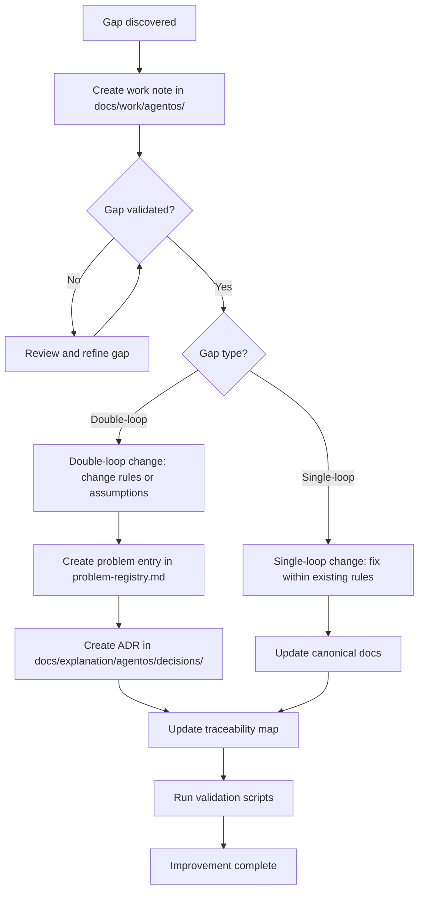

# AgentOS Self-Improvement System (Reference)

**Status**: Stable
**Date**: 2026-01-14
**Purpose**: Defines the required improvement mechanisms that preserve rationale and prevent drift.

---

## 1. Goals
- Prevent rationale loss during evolution.
- Turn gaps into durable, validated changes.
- Keep improvement actions verifiable and traceable.

## 2. Definitions
- **Improvement event**: A structured review that produces action items.
- **Gap**: Missing or incorrect guidance, tooling, or behavior.
- **Action item**: A concrete change with an owner, evidence, and a completion check.
- **Single-loop change**: Fix within existing rules.
- **Double-loop change**: Change the rules or assumptions.
- **Micro-AAR**: Short after-action review attached to a task.
- **Retrospective**: Scheduled review over a set of tasks.
- **Postmortem**: High-impact or repeated-failure review.

> **Note:** This diagram is supplementary. The authoritative contract is in Section 2: Definitions above. See `docs/reference/agentos/self-improvement.md#2-definitions` for complete requirements.

## 3. Required improvement events
- **Continuous self-assessment** during all tasks (pre-execution, mid-execution, post-execution checkpoints).
- **Micro-AAR** after each task.
- **Retrospective** on a defined cadence or milestone.
- **Postmortem** when triggers in section 4 are met.
- **Meta Analysis Mode (MAM)** when triggers in section 10 are met.

## 4. Postmortem triggers
- Repeat failures of the same class.
- High impact to safety, trust, or delivery.
- Autonomy boundary violation or destructive action risk.

## 5. Loop selection rules
- **Single-loop** when a step, doc, or gate is missing but the rules are still correct.
- **Double-loop** when failures repeat, the rules block success, or tool constraints invalidate assumptions.

## 6. Mandatory outputs
- A work note under `docs/work/agentos/` with Status and evidence.
- Action items with a completion check.
- If core behavior changes: problem entry, ADR, and traceability update.
- Updated canonical docs and validation gates when needed.
- Improvement notes must include evidence and affected artifacts fields.
- Scratch notes in `docs/local/` are non-authoritative and must be promoted to `docs/work/**` before being treated as evidence.
- Promote only decision summaries that affect future work and gaps that require contract/process changes; all other state remains local (see `docs/reference/agentos/state-surface.md`).

## 7. Meta-maintenance usage
- When task type is **AgentOS Meta-Maintenance**, consult `docs/reference/agentos/self-model.md`.

## 8. Action item rules
- Each improvement event produces at least one action item.
- Action items must be verifiable (doc update, script, or test).
- Action items must reference affected artifacts.

## 9. Continuous self-assessment
- Self-assessment checkpoints must be applied at task boundaries (pre-execution, mid-execution, post-execution).
- Self-assessment monitors state, contract compliance, objective alignment, evidence quality, performance, and gaps.
- Self-assessment outputs inform improvement events (gaps → capture, performance → micro-AAR, compliance → corrective action).
- See `docs/reference/agentos/self-awareness-framework.md` for detailed self-assessment mechanisms.

## 10. Meta Analysis Mode (MAM)
- MAM validates behavior using only the visible chat context window.
- When triggered, the agent must ask the user to enter MAM.
- If approved, the agent must follow the checklist in `docs/reference/agentos/meta-analysis.md`.
- Gaps discovered during MAM must follow the gap capture workflow.
- Triggers:
  - AgentOS Meta-Maintenance tasks.
  - Failed AgentOS validation scripts.
  - Ambiguity resolutions that change core behavior.
  - Destructive action requests or near-misses.

## 11. Related docs
- `docs/how-to/agentos/run-self-improvement-cycle.md`
- `docs/how-to/agentos/capture-gaps.md`
- `docs/reference/agentos/problem-registry.md`
- `docs/reference/agentos/decision-record-format.md`
- `docs/reference/agentos/traceability.md`
- `docs/reference/agentos/self-model.md`
- `docs/reference/agentos/meta-analysis.md`
- `docs/reference/agentos/self-awareness-framework.md`
