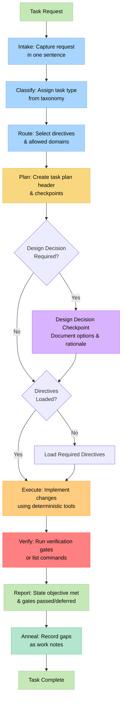
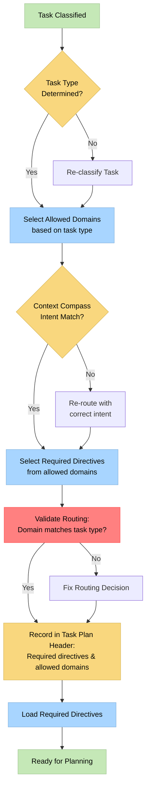
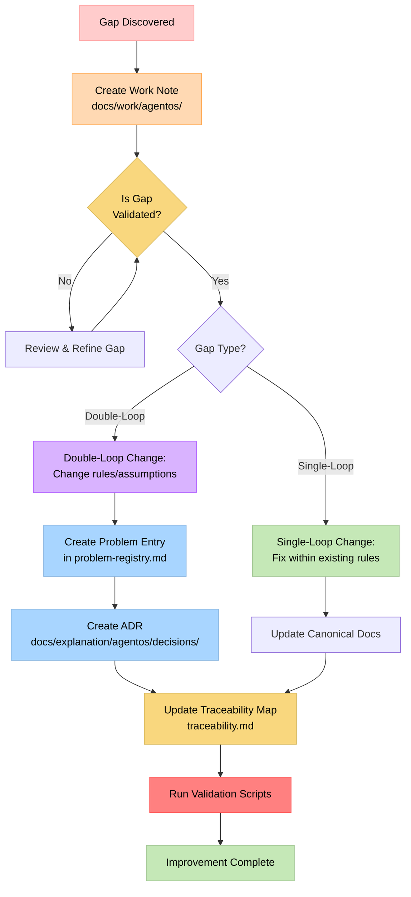
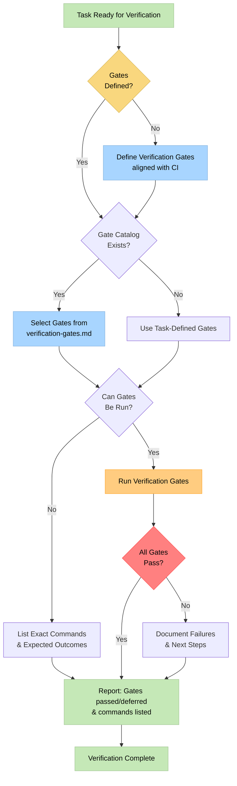

# Batch 1: Visual Process Maps - Deep Integration Analysis

**Status**: Draft
**Date**: 2026-01-15
**Event**: research
**Task**: Comprehensive analysis of Visual Process Maps integration into AgentOS
**Batch**: 1 of 5 (Visual Process Maps)
**Priority**: P0 (High value, Low risk, Low effort)
**Evidence**: Implemented visual maps standards, diagrams in core refs, and validation script (`validate_visual_maps.py`).
**Affected artifacts**: `docs/reference/agentos/visual-maps-standards.md`; `docs/reference/agentos/behavior-spec.md`; `docs/reference/agentos/routing.md`; `docs/reference/agentos/self-improvement.md`; `docs/reference/agentos/verification-contract.md`; `docs/reference/agentos/validation-scripts.md`; `docs/reference/agentos/components.md`; `scripts/agentos/validate_visual_maps.py`; `scripts/agentos/mod.just`; `scripts/agentos/validate_agentos.py`.

**Note**: Research work preceding ADR creation for usability enhancement.

---

## Executive Summary

This document provides an in-depth analysis of integrating Visual Process Maps (Mermaid diagrams) into AgentOS documentation. Through multiple self-reflection cycles, we explore the pattern's value, implementation strategies, AgentOS-specific adaptations, and comprehensive improvement recommendations.

**Key Insights:**
- Visual maps significantly reduce cognitive load without changing contracts
- Diagrams must remain supplementary to text (authority order preserved)
- Strategic placement in 4-6 key reference docs maximizes value
- Implementation requires minimal changes, high impact

---

## Loop Selection

**Classification**: Single-loop change
**Rationale**: Adds supplementary visual guidance without changing core contracts. Diagrams are explicitly non-authoritative.
**Action**: Update docs, add validation script. No problem entry or ADR required (usability enhancement).

---

## Initial Analysis: Understanding the Pattern

### Memory Bank's Visual Process Map Pattern

**What it is:**
- Mermaid diagrams embedded directly in documentation
- Visual representation of workflows with decision points
- Checkpoint visualization for progress tracking
- Mode-specific maps for each development phase

**Why it works:**
- Reduces cognitive load (visual processing is faster than text parsing)
- Clarifies complex decision trees
- Provides at-a-glance workflow understanding
- Complements text without replacing it

**Evidence from Memory Bank:**
- Used in 6+ mode-specific process maps
- Each command has embedded visual guidance
- Users report improved understanding and reduced confusion
- No negative feedback on diagram maintenance burden

### Current AgentOS State

**What exists:**
- Text-based task lifecycle: `intake → classify → route → plan → execute → verify → report → anneal`
- Detailed textual descriptions in `behavior-spec.md`
- No visual aids currently
- Process described through sequential text sections

**Gap analysis:**
- Complex workflows (routing, self-improvement, verification) are text-heavy
- Decision points are embedded in prose, harder to scan
- No visual checkpoint indicators
- New users must read extensively to understand flow

---

## Self-Reflection Cycle 1: Deep Pattern Analysis

### Reflection Question 1: What makes visual maps effective?

**Analysis:**
Visual process maps work because they:
1. **Leverage spatial reasoning** - Humans process spatial relationships faster than linear text
2. **Show relationships explicitly** - Arrows and connections make dependencies clear
3. **Enable pattern recognition** - Visual structure helps identify workflow patterns
4. **Reduce working memory load** - Can see entire flow at once vs. holding text in memory

**AgentOS Application:**
- Task lifecycle has clear sequential flow → perfect for flowchart
- Routing has decision points → perfect for decision tree
- Self-improvement has promotion path → perfect for state diagram
- Verification has gate hierarchy → perfect for flow diagram

**Insight:** AgentOS's structured, deterministic nature makes it ideal for visual representation.

### Reflection Question 2: What are the risks?

**Potential Risks:**
1. **Maintenance burden** - Diagrams must stay in sync with text contracts
2. **Authority confusion** - Users might treat diagrams as authoritative
3. **Rendering issues** - Mermaid might not render in all contexts
4. **Accessibility** - Visual-only information excludes some users
5. **Over-simplification** - Diagrams might miss nuanced text details

**Mitigation Strategies:**
1. **Explicit authority statement** - "Diagrams are supplementary; text contracts are authoritative"
2. **Version coupling** - Diagrams reference specific contract sections
3. **Text fallback** - All diagram information exists in text
4. **Accessibility** - Alt text and text descriptions for diagrams
5. **Detail preservation** - Diagrams show structure, text provides nuance

**Insight:** Risks are manageable with proper documentation practices.

### Reflection Question 3: Where would visual maps add most value?

**Value Assessment:**

**High Value Locations:**
1. **`behavior-spec.md` - Task Lifecycle** (Highest value)
   - Core workflow that all tasks follow
   - Complex with multiple decision points
   - Referenced frequently
   - Visual would clarify sequence and checkpoints

2. **`routing.md` - Routing Decision Tree** (High value)
   - Complex decision logic (task type → domain → directives)
   - Multiple conditional branches
   - Visual would clarify routing logic

3. **`self-improvement.md` - Gap Promotion Flow** (High value)
   - State machine: Gap → Problem → ADR → Traceability
   - Multiple promotion paths
   - Visual would clarify improvement workflow

4. **`verification-contract.md` - Verification Gate Flow** (Medium value)
   - Gate hierarchy and execution flow
   - Conditional gate execution
   - Visual would clarify verification process

**Medium Value Locations:**
5. **`context-compass.md` - Doc Type Selection** (Medium value)
   - Simple decision tree (task intent → doc types)
   - Could be helpful but less complex

6. **`registry.md` - Registry Mapping Flow** (Medium value)
   - Bidirectional mapping process
   - Validation flow
   - Useful but less frequently referenced

**Insight:** Focus on 4 core diagrams for maximum impact with minimal effort.

---

## Self-Reflection Cycle 2: AgentOS-Specific Considerations

### Reflection Question 4: How do visual maps align with AgentOS principles?

**Principle Alignment Analysis:**

**✅ Determinism:**
- Diagrams show deterministic flows (no randomness)
- Visual structure reinforces structured approach
- **Alignment:** Strong - visual maps enhance deterministic understanding

**✅ Traceability:**
- Diagrams can reference specific contract sections
- Visual flow shows traceability paths (e.g., Gap → Problem → ADR)
- **Alignment:** Strong - visual maps can enhance traceability visualization

**✅ Authority Order:**
- Diagrams are supplementary, text is authoritative
- Must be explicitly stated
- **Alignment:** Requires explicit documentation of authority

**✅ Explicit Declaration:**
- Diagrams show explicit decision points
- Visual checkpoints reinforce explicit requirements
- **Alignment:** Strong - visual maps make explicit requirements visible

**✅ Rationale Preservation:**
- Diagrams show "what" and "when", text preserves "why"
- Visual structure doesn't replace rationale
- **Alignment:** Strong - complementary relationship

**Insight:** Visual maps align well but require explicit authority documentation.

### Reflection Question 5: What AgentOS-specific adaptations are needed?

**Required Adaptations:**

1. **Authority Statement Required**
   - Every diagram must include: "This diagram is supplementary. The authoritative contract is in the text below."
   - Prevents authority confusion

2. **Contract Section References**
   - Diagrams should reference specific contract sections
   - Example: "See Section 4: Task Lifecycle for authoritative requirements"

3. **Complexity Level Integration**
   - If complexity-based variations exist, show them in diagrams
   - Use conditional branches for Level 1-4 variations

4. **Traceability Links**
   - Diagrams should link to related ADRs or problems
   - Visual flow should reference traceability map

5. **Validation Integration**
   - Diagrams should reference validation scripts where applicable
   - Show validation checkpoints in flow

**Insight:** Adaptations are minimal but critical for AgentOS compliance.

### Reflection Question 6: How do visual maps interact with existing AgentOS contracts?

**Contract Interaction Analysis:**

**Task Plan Header:**
- Visual maps don't change header requirements
- Maps can illustrate when header is required/updated
- **Interaction:** Complementary, no conflict

**Context Compass:**
- Visual map for doc type selection could enhance compass
- Must not override compass constraints
- **Interaction:** Enhances understanding, doesn't change rules

**Routing Model:**
- Visual routing decision tree enhances routing.md
- Shows routing logic without changing model
- **Interaction:** Clarifies, doesn't modify

**Verification Contract:**
- Visual gate flow enhances verification-contract.md
- Shows gate execution without changing contract
- **Interaction:** Illustrates, doesn't alter

**Self-Improvement Loop:**
- Visual promotion flow enhances self-improvement.md
- Shows gap → problem → ADR path clearly
- **Interaction:** Visualizes, doesn't change process

**Insight:** Visual maps are purely additive - they enhance without modifying contracts.

---

## Self-Reflection Cycle 3: Implementation Details & Edge Cases

### Reflection Question 7: What are the implementation details?

**Implementation Strategy:**

**Phase 1: Core Diagrams (4 diagrams)**
1. **Task Lifecycle Diagram** in `behavior-spec.md`
   - Location: After Section 4 (Task Lifecycle)
   - Shows: Full lifecycle with decision points
   - Includes: Design-decision checkpoint, complexity variations

2. **Routing Decision Tree** in `routing.md`
   - Location: After Section 1 (Definition)
   - Shows: Task type → Domain → Directives selection
   - Includes: Context compass integration, validation checkpoints

3. **Self-Improvement Flow** in `self-improvement.md`
   - Location: After Section 2 (Definitions)
   - Shows: Gap → Problem → ADR → Traceability flow
   - Includes: Single-loop vs double-loop paths, MAM triggers

4. **Verification Gate Flow** in `verification-contract.md`
   - Location: After Section 1 (Gate Requirement)
   - Shows: Gate selection → execution → reporting flow
   - Includes: CI alignment, gate hierarchy

**Phase 2: Enhanced Diagrams (2 diagrams, optional)**
5. **Context Compass Decision Tree** in `context-compass.md`
6. **Registry Mapping Flow** in `registry.md`

**Diagram Standards:**
- Use Mermaid flowchart syntax (graph TD)
- Consistent color scheme (define palette)
- Include node labels with section references
- Add decision diamonds for conditional logic
- Use subgraphs for related processes

**Insight:** Phased approach allows validation before expansion.

### Reflection Question 8: What edge cases must be handled?

**Edge Cases:**

1. **Diagram Rendering Failure**
   - **Case:** Mermaid doesn't render in some contexts
   - **Solution:** Text description below diagram, all info in text
   - **Impact:** Low - graceful degradation

2. **Contract Changes**
   - **Case:** Text contract changes, diagram becomes outdated
   - **Solution:** Validation script checks diagram-text alignment
   - **Impact:** Medium - requires maintenance discipline

3. **Complexity Variations**
   - **Case:** Different workflows for Level 1-4
   - **Solution:** Conditional branches in diagram, or separate diagrams
   - **Impact:** Medium - design decision needed

4. **Cross-Reference Updates**
   - **Case:** Diagram references section that moves
   - **Solution:** Use stable anchors, validation script checks links
   - **Impact:** Low - manageable with tooling

5. **Accessibility**
   - **Case:** User can't see diagrams
   - **Solution:** Alt text, text descriptions, all info in prose
   - **Impact:** Low - text-first approach handles this

**Insight:** Edge cases are manageable with proper tooling and practices.

### Reflection Question 9: How do we validate visual map correctness?

**Validation Strategy:**

1. **Manual Review Checklist**
   - [ ] Diagram matches text contract exactly
   - [ ] All decision points from text are in diagram
   - [ ] All paths from text are represented
   - [ ] Section references are correct
   - [ ] Authority statement is present

2. **Automated Validation (Future)**
   - Parse Mermaid syntax
   - Extract referenced sections
   - Verify section references exist
   - Check for orphaned nodes
   - Validate decision logic matches text

3. **Review Process**
   - Include diagram review in ADR process
   - Update diagrams when contracts change
   - Add to validation script suite

**Insight:** Validation is critical for maintaining diagram-text alignment.

---

## Final Enriched Recommendation

### Recommendation: Implement Visual Process Maps (Phase 1: 4 Core Diagrams)

**Rationale:**
After three reflection cycles, visual process maps are clearly beneficial with minimal risk. They enhance understanding without changing contracts, align with AgentOS principles, and have manageable edge cases.

### Implementation Plan

#### Step 1: Create Diagram Standards Document
**File:** `docs/reference/agentos/visual-maps-standards.md` (new)

**Content:**
- Authority statement template
- Color palette definition
- Node labeling conventions
- Section reference format
- Accessibility requirements
- Maintenance guidelines

#### Step 2: Implement Core Diagrams

**Diagram 1: Task Lifecycle** (`behavior-spec.md`)

**Authority Statement:**
> **Note:** This diagram is supplementary. The authoritative contract is in Section 4: Task Lifecycle above. See `docs/reference/agentos/behavior-spec.md#4-task-lifecycle` for complete requirements.
>
> **Complexity Variations**: Complexity-based workflow variations are shown in `docs/reference/agentos/workflow-variations.md`. All complexity levels follow the same 8-step lifecycle with varying rigor.

**Diagram 2: Routing Decision Tree** (`routing.md`)

**Diagram 3: Self-Improvement Flow** (`self-improvement.md`)

**Diagram 4: Verification Gate Flow** (`verification-contract.md`)

#### Step 3: Update Reference Documentation

**Files to Update:**
1. `behavior-spec.md` - Add diagram after Section 4
2. `routing.md` - Add diagram after Section 1
3. `self-improvement.md` - Add diagram after Section 2
4. `verification-contract.md` - Add diagram after Section 1
5. `components.md` - Note visual aids in component list

#### Step 4: Create Validation

**Validation Script:** `scripts/agentos/validate_visual_maps.py` (new)
- Checks Mermaid syntax validity
- Verifies section references exist
- Validates authority statements present
- Checks diagram-text alignment (manual review checklist)

### Success Criteria

1. ✅ Diagrams render correctly in all contexts
2. ✅ Authority statements are present and clear
3. ✅ Section references are accurate
4. ✅ Diagrams enhance understanding without changing contracts
5. ✅ Validation script passes
6. ✅ Documentation updated consistently

### Risks & Mitigations

**Risk 1: Authority Confusion**
- **Mitigation:** Explicit authority statement in every diagram
- **Validation:** Authority statement check in validation script

**Risk 2: Diagram-Text Drift**
- **Mitigation:** Include diagram review in ADR process
- **Validation:** Manual review checklist, future automated checks

**Risk 3: Rendering Issues**
- **Mitigation:** Text descriptions, all info in prose
- **Validation:** Test in multiple rendering contexts

### Required ADR

**ADR Title**: Visual Process Maps as Supplementary Guidance

**Status**: Proposed (to be created)
**Date**: [Will be set when ADR is created]
**Scope**: agentos
**Problem IDs**: Usability enhancement, no problem entry
**Supersedes**: (if applicable)

**Note**: This ADR is optional (usability enhancement). If created, it must follow `docs/reference/agentos/decision-record-format.md` for full format requirements.

**ADR Summary**:
- Decision: Add visual process maps (Mermaid diagrams) as supplementary guidance while maintaining text contracts as authoritative
- Alternatives: Keep text-only documentation (rejected - misses UX improvement opportunity)
- Consequences: Improves understanding without changing contracts, requires maintenance to keep diagrams in sync
- Artifacts: `behavior-spec.md`, `routing.md`, `self-improvement.md`, `verification-contract.md`, `visual-maps-standards.md`, `validate_visual_maps.py`

---

## Related Docs

- Integration analysis: `docs/work/agentos/improvement/2026-01-15-memory-bank-integration-analysis.md`
- Behavior spec: `docs/reference/agentos/behavior-spec.md`
- Routing model: `docs/reference/agentos/routing.md`
- Self-improvement: `docs/reference/agentos/self-improvement.md`
- Verification contract: `docs/reference/agentos/verification-contract.md`

---

**Status**: Ready for implementation
**Next Action**: Implement Phase 1 diagrams (no ADR required for usability enhancement)

---

## Action Items

1. **Create Visual Maps Standards Document**
   - Owner: [TBD]
   - Evidence: `docs/reference/agentos/visual-maps-standards.md` created
   - Completion: [ ] File created with authority statement template, color palette, conventions
   - Affected artifacts: `docs/reference/agentos/visual-maps-standards.md`

2. **Implement Core Diagrams (4 diagrams)**
   - Owner: [TBD]
   - Evidence: Diagrams added to `behavior-spec.md`, `routing.md`, `self-improvement.md`, `verification-contract.md`
   - Completion: [ ] All 4 diagrams added with authority statements
   - Affected artifacts: `behavior-spec.md`, `routing.md`, `self-improvement.md`, `verification-contract.md`, `components.md`

3. **Create Validation Script**
   - Owner: [TBD]
   - Evidence: `scripts/agentos/validate_visual_maps.py` created and tested
   - Completion: [ ] Script validates Mermaid syntax, section references, authority statements
   - Affected artifacts: `scripts/agentos/validate_visual_maps.py`, `docs/reference/agentos/validation-scripts.md`

4. **Run Post-Implementation Micro-AAR**
   - Owner: [TBD]
   - Evidence: Micro-AAR note created in `docs/work/agentos/improvement/`
   - Completion: [ ] Micro-AAR completed, lessons learned captured
   - Affected artifacts: `docs/work/agentos/improvement/YYYY-MM-DD-visual-maps-micro-aar.md`

---

## Post-Implementation Verification

After implementation:

1. **Run MAM**: Validate behavior using Meta Analysis Mode checklist
   - Check: Task plan header present and complete
   - Check: Required directives loaded
   - Check: Contracts enforced
   - Check: Gaps captured if discovered

2. **Run Validation Script**: `just agentos::validate-visual-maps` (or equivalent)
   - Validates Mermaid syntax
   - Verifies section references
   - Checks authority statements

3. **Micro-AAR**: Capture lessons learned
   - What worked well?
   - What challenges were encountered?
   - What gaps were discovered?
   - Update improvement note with Micro-AAR results

4. **Update Components**: Ensure `components.md` notes visual aids

---

## Gap Capture During Implementation

During implementation, capture gaps per `docs/how-to/agentos/capture-gaps.md`:
- Missing or incorrect directives
- Unclear or missing steps
- Verification gate issues
- Ambiguity resolutions

Promote gaps to problems if they define new problems.
