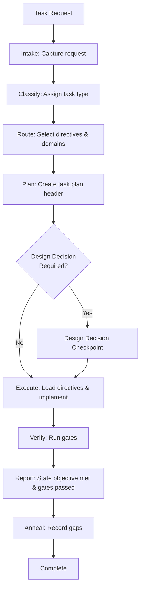

# Memory Bank Pattern Integration Analysis

**Status**: Draft
**Date**: 2026-01-15
**Event**: research
**Task**: Analyze integration of cursor-memory-bank patterns into AgentOS
**Evidence**: Analysis of both systems' architectures and design patterns
**Affected artifacts**: Potential future changes to AgentOS core contracts

**Note**: This is research/analysis work preceding ADR creation. Standard improvement events (micro-aar, retrospective, postmortem) will occur during and after implementation.

---

## Executive Summary

This analysis evaluates key patterns from the cursor-memory-bank system for potential integration into AgentOS. The goal is to enhance AgentOS's capabilities while maintaining its core principles of determinism, traceability, and rationale preservation.

**Key Findings:**
- **High-value patterns**: Hierarchical rule loading, visual process maps, progressive documentation, adaptive complexity model
- **Medium-value patterns**: Creative phase methodology, command-based workflow (as UI enhancement)
- **Alignment**: Most patterns align with AgentOS principles but require adaptation
- **Tradeoffs**: Integration must preserve AgentOS's deterministic, traceable nature

---

## Pattern Analysis & Integration Proposals

### 1. Hierarchical/JIT Rule Loading

**Memory Bank Pattern:**
- Loads only essential rules initially (~70% token reduction)
- Lazy-loads specialized rules when needed
- Core rule caching across transitions
- Complexity-based rule selection

**Current AgentOS State:**
- Context Compass constrains doc types by task intent
- Routing selects required directives and allowed domains
- No explicit hierarchical loading strategy
- All core docs listed in `.cursor/rules/20-agentos.topic.mdc` (may load all)

**Integration Proposal:**

#### Option A: Enhanced Context Compass with Hierarchical Loading
**Approach:** Extend `context-compass.md` with hierarchical loading tiers

```markdown
## 5. Hierarchical Loading Tiers
- **Tier 1 (Always)**: behavior-spec.md, architecture.md, routing.md, context-compass.md
- **Tier 2 (By Task Type)**: Task-type-specific contracts
- **Tier 3 (By Complexity)**: Complexity-appropriate verification gates
- **Tier 4 (Phase-Specific)**: Specialized rules (design-decision checkpoints, meta-analysis)
- **Tier 5 (Specialized)**: Rarely-used specialized rules (registry mapping, bootstrap gates)
```

**Benefits:**
- Reduces initial context usage
- Maintains AgentOS's explicit routing model
- Preserves traceability (loading plan in task header)

**Changes Required:**
- Update `context-compass.md` with hierarchical tiers
- Update `cursor-adapter.md` with tier-based loading instructions
- Update task plan header to include "Loading tier used"

**Tradeoffs:**
- ✅ Maintains explicit declaration (AgentOS principle)
- ✅ Reduces token usage
- ⚠️ Adds complexity to routing decisions
- ⚠️ Requires validation that tiers are correct

#### Option B: Directive Loading Plan Enhancement
**Approach:** Enhance existing "directive loading plan" in task plan header with lazy-loading triggers

**Benefits:**
- Minimal changes to existing contracts
- Explicit lazy-loading triggers maintain traceability

**Changes Required:**
- Enhance `behavior-spec.md` directive loading plan format
- Add examples of deferred directive triggers

**Recommendation:** Option A (more comprehensive, aligns with Memory Bank's proven approach)

---

### 2. Visual Process Maps

**Memory Bank Pattern:**
- Mermaid diagrams embedded in each command
- Visual workflow guidance with decision points
- Checkpoint visualization
- Reduces cognitive load

**Current AgentOS State:**
- Text-based task lifecycle (intake → classify → route → plan → execute → verify → report → anneal)
- No visual guidance
- Process described in `behavior-spec.md`

**Integration Proposal:**

#### Visual Task Lifecycle Maps
**Approach:** Add Mermaid diagrams to key reference docs

**Locations:**
1. `behavior-spec.md` - Main task lifecycle diagram
2. `routing.md` - Routing decision tree
3. `self-improvement.md` - Gap → Problem → ADR flow
4. `verification-contract.md` - Verification gate flow

**Example for behavior-spec.md:**


**Benefits:**
- Improves understanding of workflow
- Reduces cognitive load
- Maintains text-based contracts (diagrams are supplementary)

**Changes Required:**
- Add diagrams to reference docs
- Keep text contracts as authoritative
- Update `components.md` to note visual aids

**Tradeoffs:**
- ✅ Enhances usability without changing contracts
- ✅ Diagrams are supplementary, not authoritative
- ⚠️ Requires maintenance when contracts change
- ⚠️ May increase doc size (but improves clarity)

**Recommendation:** Implement (low risk, high value)

---

### 3. Progressive Documentation

**Memory Bank Pattern:**
- Concise initial templates
- "Detail-on-demand" approach
- Tabular formats for comparisons
- Scales with complexity

**Current AgentOS State:**
- Design-decision checkpoints required for material decisions
- No explicit template structure
- ADRs have fixed format

**Integration Proposal:**

#### Enhanced Design-Decision Checkpoint Templates
**Approach:** Add progressive documentation templates to design-decision checkpoints

**Tier 1 (Initial):** Concise template
```markdown
## Design Decision: [Component Name]

**Options Considered:** [List 2-3 options]
**Selected Approach:** [Brief description]
**Rationale:** [1-2 sentences]
**Tradeoffs:** [Brief table]

[Detail-on-demand: Expand for Level 3-4 tasks]
```

**Tier 2 (Expanded):** Full analysis (on demand or for Level 3-4)
- Detailed option analysis
- Comprehensive tradeoff matrix
- Implementation guidance

**Benefits:**
- Reduces documentation burden for simple decisions
- Maintains thoroughness for complex decisions
- Aligns with complexity levels

**Changes Required:**
- Update `behavior-spec.md` design-decision checkpoint section
- Create template in `how-to/agentos/` or reference doc
- Link from task plan header requirements

**Tradeoffs:**
- ✅ Maintains requirement for design decisions
- ✅ Scales appropriately
- ⚠️ Need to define when to expand (complexity level?)

**Recommendation:** Implement with complexity-based triggers

---

### 4. Adaptive Complexity Model

**Memory Bank Pattern:**
- 4-level complexity scale (1-4)
- Level-specific workflows
- Complexity-appropriate documentation
- Determines which commands to use

**Current AgentOS State:**
- Task taxonomy (12 task types)
- Complexity level mentioned in task plan header (1-4) with rationale
- No explicit complexity-based workflow variations
- All tasks follow same lifecycle

**Integration Proposal:**

#### Complexity-Based Workflow Variations
**Approach:** Define workflow variations by complexity level while maintaining core lifecycle

**Level 1 (Quick Fix):**
- All 8 lifecycle steps present with minimal rigor: intake → classify → route → plan → execute → verify → report → anneal
- Design-decision checkpoint optional (only if material decision exists)
- Minimal documentation
- Basic verification

**Level 2 (Simple Enhancement):**
- Standard lifecycle with optional design-decision checkpoint
- Basic documentation
- Standard verification

**Level 3-4 (Feature/System):**
- Full lifecycle with mandatory design-decision checkpoint
- Comprehensive documentation
- Full verification gates

**Benefits:**
- Reduces overhead for simple tasks
- Maintains rigor for complex tasks
- Aligns with existing complexity level in header

**Changes Required:**
- Update `behavior-spec.md` task lifecycle section
- Add complexity-based workflow variations
- Update task plan header to include "Workflow variation"
- Ensure all variations maintain core principles

**Tradeoffs:**
- ✅ Addresses PRB-0001 (goal drift) by maintaining structure
- ✅ Reduces unnecessary overhead
- ⚠️ Must ensure variations don't compromise traceability
- ⚠️ Need clear criteria for complexity level determination

**Recommendation:** Implement with strict constraints (all variations must maintain core lifecycle steps, just with different rigor)

---

### 5. Creative Phase Methodology (Claude "Think" Tool)

**Memory Bank Pattern:**
- Structured design exploration phases
- Component breakdown → Option exploration → Trade-off analysis → Decision documentation
- Mandatory for Level 3-4 tasks
- Tabular comparison formats

**Current AgentOS State:**
- Design-decision checkpoint required for material decisions
- No explicit methodology
- ADRs capture decisions but not exploration process

**Integration Proposal:**

#### Enhanced Design-Decision Checkpoint with Structured Exploration
**Approach:** Enhance design-decision checkpoint with Memory Bank's structured phases

**Phase 1: Component Breakdown**
- Functional requirements
- Technical constraints
- Integration points

**Phase 2: Option Exploration**
- List 2-3 viable options
- Brief description of each

**Phase 3: Trade-off Analysis**
- Tabular comparison (criteria × options)
- Pros/cons for each option

**Phase 4: Decision Documentation**
- Selected approach
- Rationale
- Discarded alternatives
- Implementation guidance

**Benefits:**
- Systematic exploration prevents premature decisions
- Better rationale preservation
- Aligns with AgentOS's rationale preservation goal (PRB-0005)

**Changes Required:**
- Update `behavior-spec.md` design-decision checkpoint section
- Create template in reference or how-to doc
- Link from task plan header

**Tradeoffs:**
- ✅ Enhances rationale preservation (core AgentOS goal)
- ✅ Maintains requirement structure
- ⚠️ Adds process overhead (but improves decision quality)
- ⚠️ Need to define when mandatory vs optional

**Recommendation:** Implement as enhancement to existing design-decision checkpoint (not replacement)

---

### 6. Command-Based Workflow (UI Enhancement)

**Memory Bank Pattern:**
- Cursor 2.0 commands (`/van`, `/plan`, `/creative`, `/build`, etc.)
- Command-based entry points
- Workflow progression through commands

**Current AgentOS State:**
- Task lifecycle is behavioral contract
- No UI-specific entry points
- Adapter-agnostic design

**Integration Proposal:**

#### Optional Cursor Commands for AgentOS Workflow
**Approach:** Create optional Cursor commands that map to AgentOS lifecycle phases

**Commands:**
- `/agentos-start` - Maps to intake + classify + route
- `/agentos-plan` - Maps to plan phase
- `/agentos-design` - Maps to design-decision checkpoint
- `/agentos-execute` - Maps to execute phase
- `/agentos-verify` - Maps to verify phase
- `/agentos-report` - Maps to report + anneal

**Benefits:**
- Better UX in Cursor
- Maintains behavioral contract (commands are UI layer)
- Optional (doesn't change core)

**Changes Required:**
- Create `.cursor/commands/` directory with AgentOS commands
- Document as adapter enhancement (not core)
- Ensure commands enforce AgentOS contracts

**Tradeoffs:**
- ✅ Enhances usability without changing core
- ✅ Maintains adapter boundary
- ⚠️ Requires maintenance
- ⚠️ Must not override core behavior

**Recommendation:** Implement as optional adapter enhancement (not core contract)

---

## Integration Priority Matrix

| Pattern | Value | Effort | Risk | Priority | Recommendation |
|---------|-------|--------|------|----------|----------------|
| Visual Process Maps | High | Low | Low | **P0** | Implement immediately |
| Hierarchical Rule Loading | High | Medium | Medium | **P1** | Implement with validation |
| Progressive Documentation | Medium | Low | Low | **P1** | Implement for design checkpoints |
| Adaptive Complexity Model | High | High | Medium | **P2** | Implement with strict constraints |
| Creative Phase Methodology | Medium | Medium | Low | **P2** | Enhance existing checkpoints |
| Command-Based Workflow | Low | Medium | Low | **P3** | Optional adapter enhancement |

---

## Implementation Sequence

Due to cross-batch dependencies, implement in this order:

1. **Batch 1 (Visual Maps)** - Can be done independently
2. **Batch 2 (Hierarchical + Progressive)** - Foundation for others
3. **Batch 3 (Complexity)** - Requires Batch 2 Tier 3
4. **Batch 4 (Structured Exploration)** - Requires Batch 2 + 3
5. **Batch 5 (Commands)** - Requires all previous batches

---

## Implementation Strategy

### Phase 1: Low-Risk Enhancements (P0-P1)
1. **Add Visual Process Maps**
   - Add Mermaid diagrams to key reference docs
   - Keep text contracts as authoritative
   - Update `components.md`

2. **Implement Hierarchical Rule Loading**
   - Extend `context-compass.md` with loading tiers
   - Update `cursor-adapter.md`
   - Add validation

3. **Progressive Documentation Templates**
   - Create templates for design-decision checkpoints
   - Link from `behavior-spec.md`

### Phase 2: Medium-Risk Enhancements (P2)
4. **Adaptive Complexity Model**
   - Define workflow variations by complexity
   - Ensure all variations maintain core lifecycle
   - Add validation gates

5. **Creative Phase Methodology**
   - Enhance design-decision checkpoint with structured phases
   - Create templates and examples

### Phase 3: Optional Enhancements (P3)
6. **Command-Based Workflow**
   - Create optional Cursor commands
   - Document as adapter enhancement
   - Ensure compliance with core contracts

---

## Integration Testing Strategy

After implementing each batch, test integration with previous batches:

1. **After Batch 2**: Test hierarchical loading with Context Compass constraints
2. **After Batch 3**: Test complexity-based tier loading (Tier 3)
3. **After Batch 4**: Test structured exploration with progressive templates
4. **After Batch 5**: Test commands with all patterns
5. **End-to-end**: Test complete workflow with all patterns active

---

## Migration Path for Existing Tasks

For tasks already in progress when patterns are implemented:

1. **Determine Complexity Retroactively**: Use complexity-determination criteria to assign level
2. **Add Loading Plan**: Update task plan header with tier-based loading plan
3. **Apply Structured Exploration**: If design-decision checkpoint exists, enhance with structured phases
4. **Update Commands**: If using commands, ensure they align with current task phase

---

## Constraints & Principles to Maintain

### Must Preserve:
1. **Deterministic Behavior** - All changes must maintain explicit, auditable behavior
2. **Traceability** - All decisions must be traceable to problems and ADRs
3. **Rationale Preservation** - Enhanced documentation must preserve why decisions were made
4. **Authority Order** - Visual aids are supplementary, text contracts are authoritative
5. **Adapter Boundary** - Commands are UI layer, not core contract

### Must Not Compromise:
1. **Task Lifecycle** - Core sequence must remain (variations allowed but core steps required)
2. **Verification Contract** - Gates must remain explicit and aligned with CI
3. **Registry Mapping** - Doc ↔ code mapping must remain deterministic
4. **Safety Policy** - Destructive action confirmation must remain
5. **Self-Improvement Loop** - Gap capture and promotion must remain

---

## Required ADRs

**Note**: These ADRs must be created before implementation. See individual batch documents for full ADR requirements.

If integration proceeds, the following ADRs should be created:

1. **ADR: Hierarchical Rule Loading for Context Efficiency**
   - Problem: PRB-0002 (Context Instability) - token efficiency aspect
   - Decision: Implement tiered loading with explicit declaration
   - Artifacts: `context-compass.md`, `cursor-adapter.md`, `behavior-spec.md`

2. **ADR: Visual Process Maps as Supplementary Guidance**
   - Problem: Usability enhancement (not addressing existing problem)
   - Decision: Add visual aids while maintaining text contracts as authoritative
   - Artifacts: `behavior-spec.md`, `routing.md`, `self-improvement.md`, `verification-contract.md`

3. **ADR: Adaptive Complexity Workflow Variations**
   - Problem: PRB-0001 (Goal Drift) - efficiency aspect
   - Decision: Define workflow variations by complexity while maintaining core lifecycle
   - Artifacts: `behavior-spec.md`, task plan header requirements

4. **ADR: Enhanced Design-Decision Checkpoint Methodology**
   - Problem: PRB-0005 (Rationale Loss) - enhancement
   - Decision: Add structured exploration phases to design-decision checkpoints
   - Artifacts: `behavior-spec.md`, design-decision checkpoint templates

---

## Validation Requirements

For each integration:

1. **Contract Compliance**
   - Verify changes maintain core contracts
   - Ensure traceability is preserved
   - Validate authority order is respected

2. **Validation Scripts**
   - Update validation scripts if contracts change
   - Add tests for new patterns
   - Verify backward compatibility

3. **Documentation Updates**
   - Update all affected reference docs
   - Update traceability map
   - Update `components.md` if new components added

4. **Adapter Testing**
   - Test Cursor adapter with new patterns
   - Verify rule loading works correctly
   - Ensure visual aids render properly

---

## Risks & Mitigations

### Risk 1: Pattern Mismatch
**Risk:** Memory Bank patterns optimized for flexibility may conflict with AgentOS determinism
**Mitigation:** Adapt patterns to maintain explicit declaration and traceability

### Risk 2: Complexity Creep
**Risk:** Adding patterns increases system complexity
**Mitigation:** Implement incrementally, validate each phase, maintain core simplicity

### Risk 3: Maintenance Burden
**Risk:** Visual aids and templates require maintenance
**Mitigation:** Keep text contracts authoritative, visual aids are supplementary

### Risk 4: Adapter Confusion
**Risk:** Commands might be mistaken for core contracts
**Mitigation:** Clearly document as adapter enhancement, maintain adapter boundary

---

## Success Criteria

Integration is successful if:

1. ✅ Token usage reduced by 30-50% (hierarchical loading)
2. ✅ Visual aids improve understanding without changing contracts
3. ✅ Complexity-based variations reduce overhead for simple tasks
4. ✅ Design-decision checkpoints produce better rationale
5. ✅ All changes maintain AgentOS core principles
6. ✅ All changes are traceable to ADRs
7. ✅ Validation scripts pass
8. ✅ Documentation is updated and consistent

---

## Related Docs

- Memory Bank analysis: `docs/work/agentos/improvement/2026-01-15-comprehensive-cross-file-analysis.md` (cursor-memory-bank section)
- AgentOS core contracts: `docs/reference/agentos/behavior-spec.md`, `docs/reference/agentos/architecture.md`
- Context management: `docs/reference/agentos/context-compass.md`, `docs/reference/agentos/routing.md`
- Self-improvement: `docs/reference/agentos/self-improvement.md`

---

## Next Steps

1. **Review this analysis** with stakeholders
2. **Prioritize patterns** based on value/effort/risk
3. **Create ADRs** for approved integrations
4. **Implement Phase 1** (low-risk enhancements)
5. **Validate and iterate** before Phase 2

---

**Status**: Ready for review
**Next Action**: Stakeholder review and prioritization decision
