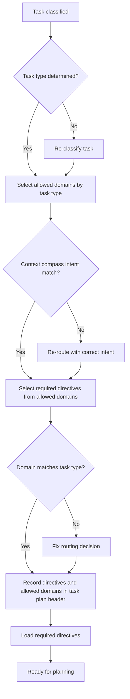

# AgentOS Alignment Mechanisms (Reference)

**Status**: Stable
**Date**: 2026-01-14
**Purpose**: Defines the operational implementations that maintain surface alignment.

---

## 1. Architectural Interfaces

This document implements the architectural patterns defined in `architectural-patterns.md` and enforces the contracts specified in `coherence-contract.md`, `evolution-framework.md`, and `validation-contract.md`.

### 1.1. Implementation Layer
- **Registry Mapping**: Implements bidirectional docs↔code linking
- **Context Loading**: Operationalizes tiered directive loading
- **State Management**: Handles authoritative vs local state boundaries
- **Synchronization**: Maintains surface alignment through operational processes

### 1.2. DOE Operational Model
- **Directive**: Documentation as source of truth (contracts layer)
- **Orchestration**: Task routing and directive selection (this implementation)
- **Execution**: Deterministic tools with evidence production (tool integration)

## 2. Task Lifecycle Implementation
**8-Phase Sequence**: intake→classify→route→plan→execute→verify→report→anneal
- **Classify**: Assign task type and complexity level (1-4)
- **Route**: Select directives and domains by task type
- **Plan**: Create header with objectives, directives, domains
- **Execute**: Follow deterministic processes
- **Verify**: Run CI-aligned gates or list commands
- **Anneal**: Capture gaps as work notes

## 2. Registry Mapping

**Purpose**: Bidirectional docs↔code links prevent surface drift.

**Annotations**:
- Code: `# @directive docs/path.md`
- Docs: `@implementation code/path.py`

**Scope**: Source, config, scripts, tests (defined in AGENTS.md). Excludes generated, vendor, local state.

**Requirements**: Complete, bidirectional, accurate, current links.

**Maintenance**: Add on creation, update on moves, validate regularly, fix breaks.

## 3. Context Loading and Routing

### 3.1. Context Compass
The context compass constrains documentation loading by task intent:

| Task Intent | Allowed Doc Types | Purpose |
|-------------|-------------------|---------|
| Execution | reference + how-to | Apply existing knowledge |
| Learning | tutorials | Acquire new knowledge |
| Architecture | explanation + reference | Understand design rationale |
| Meta-Maintenance | reference + how-to + explanation | Evolve the system |

### 3.2. Directive Loading Tiers

Directives are loaded in hierarchical tiers with explicit triggers, respecting Context Compass intent constraints.

#### 3.2.1. Loading Sequence
Directives must be loaded in tier order:
1. **Tier 1 (Core)**: Load first if intent allows reference docs
2. **Tier 2 (Task-type)**: Load after Tier 1 based on routing
3. **Tier 3 (Complexity)**: Load based on complexity level
4. **Tier 4 (Phase)**: Load only on lifecycle triggers
5. **Tier 5 (Specialized)**: Load only on rare explicit triggers

#### 3.2.2. Tier Definitions and Triggers

**Tier 1 (Core)**: Always loaded for reference-allowed tasks
- Trigger: Always (if intent allows reference docs)
- Load: coherence-contract.md, evolution-framework.md, validation-contract.md, architectural-patterns.md, alignment-mechanisms.md
- Defer: Never (core contracts required)

**Tier 2 (Task-Type)**: Loaded based on routing decisions
- Trigger: After routing determines task type and allowed domains
- Load: Domain-specific directives for the task type, safety policies for destructive operations, verification contracts for testing tasks
- Defer: If task type unclear or routing incomplete

**Tier 3 (Complexity)**: Loaded based on complexity level
- Trigger: After complexity level determined
- Load: Level-appropriate verification gates, complexity-specific templates and workflows
- Defer: If complexity level not yet determined

**Tier 4 (Phase)**: Loaded on lifecycle triggers
- Trigger: When specific lifecycle phase reached
  - Design-decision checkpoint: when checkpoint required (Level 3-4 or material decision)
  - Meta-analysis: when MAM triggered
- Load: Phase-specific directives (design-decision templates, structured exploration, meta-analysis framework)
- Defer: Until phase is reached

**Tier 5 (Specialized)**: Loaded for rare explicit needs
- Trigger: Explicit need identified
  - Registry: when registry mapping work required
  - Bootstrap: during bootstrap mode only
- Load: Specialized directives (registry documentation, bootstrap guides)
- Defer: Until explicit need identified

#### 3.2.3. Deferral Criteria
Defer loading a directive when:
- **Intent constraint**: Doc type not allowed by Context Compass for task intent
- **Phase not reached**: Directive is Tier 4/5 and trigger not yet occurred
- **Routing incomplete**: Task type or allowed domains not yet determined
- **Complexity unknown**: Tier 3 directive but complexity level not determined
- **Context constrained**: Minimal mode active

**Deferral requirements**:
- Must list deferred directives in task plan header
- Must include explicit, auditable trigger for each deferred directive
- Must load deferred directives when trigger occurs
- Example: "Deferred: design-decision-templates.md (trigger: design-decision checkpoint required)"

#### 3.2.4. Minimal Mode
**Definition**: Used when context window is severely constrained (>80% full) or for very complex tasks requiring maximum implementation space.

**When to use**:
- Context window >80% full
- Complex tasks (Level 3-4) with many dependencies
- Large codebases requiring extensive context

**What to load in minimal mode**:
- Tier 1 (Core): Only absolute minimum (coherence-contract.md, evolution-framework.md, validation-contract.md)
- Tier 2-5: Defer all except absolutely critical for current phase

**Tradeoffs**:
- **Reduced guidance**: Less directive context available
- **More implementation space**: More context for code and files

**Documentation**: If minimal mode is used, must be documented in task plan header with rationale.

#### 3.2.5. Context Window Monitoring
**Guidance for tracking context usage**:
- Monitor context window usage during task execution
- If context >70% full, consider deferring non-critical directives
- If context >80% full, consider minimal mode
- Track which directives are actually used vs. loaded but unused

**Optional tracking in task plan header**:
- Context usage estimate: "Low/Medium/High" or percentage if known
- Minimal mode indicator: "yes/no" if minimal mode used
- Rationale: Brief explanation if minimal mode used or context tracking shows issues

**Note**: Context tracking is optional guidance, not a requirement. The primary mechanism for context efficiency is selective loading by tier.

### 3.3. Workflow Variations by Complexity

| Step | Level 1 | Level 2 | Level 3 | Level 4 |
|------|---------|---------|---------|---------|
| Intake | Minimal capture | Standard | Comprehensive | Enterprise |
| Classify | Minimal | Standard | Detailed | Detailed |
| Route | Tier 1-2 | Tier 1-3 | Tier 1-4 | Tier 1-4 (+Tier 5) |
| Plan | Minimal header | Standard header | Comprehensive w/ checkpoints | Enterprise phased |
| Execute | Direct | Planned | Systematic | Phased with reviews |
| Verify | Basic (smoke) | Standard gates | Comprehensive gates | Enterprise gates (phased) |
| Report | Brief | Standard | Detailed | Enterprise w/ lessons |
| Anneal | Quick note | Standard | Comprehensive | Retrospective |

### 3.4. Routing Model
Routing selects directives and domains based on:
- Task type classification
- Primary objective analysis
- Complexity level determination
- Required domain capabilities

**Routing Output**: Task plan header with:
- Required directives (with loading plan)
- Allowed domains
- Routing rationale



> **Note:** This diagram is supplementary. The authoritative contract is in Section 3.4: Routing Model above.

### 3.5. Domain Boundaries
Domains provide scoped execution contexts:
- **Directive Scope**: Only domain-relevant documentation loaded
- **File Scope**: Only domain-relevant files modified
- **Tool Scope**: Only domain-appropriate tools used
- **Validation Scope**: Domain-specific verification gates

### 3.6. Cursor-Enhanced Context Loading

AgentOS leverages Cursor's deterministic loading mechanics to provide intelligent reasoning support:

#### 3.6.1. alwaysApply Rules (Core Reasoning Engine)
Loaded at startup, these provide the foundational reasoning infrastructure:

**Decision Trees**:
```
Task Classification
├── Has clear objective? → Route to execution patterns
├── Multiple stakeholders? → Route to coordination frameworks
├── Technical complexity? → Route to architectural patterns
└── Time pressure? → Route to rapid validation protocols
```

**Invariant Validators**:
- Surface alignment checks
- Authority hierarchy enforcement
- Safety constraint validation
- Complexity level assessment

**Authority Resolution**:
- Truth surface ordering logic
- Evidence hierarchy application
- Conflict resolution protocols

#### 3.6.2. description Rules (Semantic Reasoning Aids)
Keyword-triggered loading of specialized reasoning frameworks:

**Routing Instructions**:
- "When 'refactor' detected → Load complexity assessment + impact analysis"
- "When 'security' detected → Load threat modeling + validation frameworks"
- "When 'performance' detected → Load profiling + optimization patterns"

**Pre-reasoning Frameworks**:
- Stakeholder analysis templates
- Risk assessment matrices
- Dependency mapping tools
- Change impact predictors

#### 3.6.3. globs Rules (Structural Reasoning)
Path-based loading of project-aware reasoning:

**Directory Analysis**:
- `src/` → Implementation patterns + testing frameworks
- `docs/` → Documentation standards + validation rules
- `tests/` → Quality assurance + coverage analysis
- `scripts/` → Automation patterns + deployment logic

**File Type Intelligence**:
- `*.md` → Documentation reasoning + structure validation
- `*.py` → Python patterns + import analysis
- `*.json` → Configuration reasoning + schema validation
- `*.yaml` → Infrastructure patterns + deployment logic

#### 3.6.4. Mode Constraints & Reasoning Integration
**Ask Mode**: Read-only reasoning support
- Loads analysis frameworks and decision trees
- Provides reasoning guidance without execution
- Enables "what would you do" scenario planning

**Agent Mode**: Full reasoning + execution
- Loads complete reasoning stacks + execution tools
- Sandboxed command execution with reasoning validation
- Pre-execution reasoning checks + post-execution analysis

#### 3.6.5. Behavior-Deterministic Documentation Reduction
With enhanced reasoning aids, documentation can be reduced through:

**Decision Tree Replacement**:
- Complex routing logic → Pre-computed decision trees
- Stakeholder analysis → Structured frameworks
- Risk assessment → Automated matrices

**Validation Automation**:
- Manual checklists → Automated invariant checking
- Quality reviews → Algorithmic validation
- Compliance verification → Rule-based assessment

**Contextual Intelligence**:
- Explicit instructions → Pattern recognition
- Manual reasoning → Automated frameworks
- Documentation lookup → Intelligent loading

### 3.6. Visual Process Maps

**Standards for Diagrams**:
- Use Mermaid syntax for flowchart, sequence, and graph diagrams
- Include in core reference docs as supplementary to text
- Diagrams must not contradict authoritative text
- Update diagrams when processes change

**Common Diagram Types**:
- Task lifecycle flowcharts
- Decision trees for complexity determination
- Context loading tier sequences
- Evolution protocol workflows
- Validation script relationships

## 4. State Surface Management

### 4.1. Authoritative vs Local State
**Authoritative State**: Permanent, validated, evidence-bearing
- Location: `docs/reference/`, `docs/how-to/`, `docs/explanation/`
- Characteristics: Version controlled, validated, traceable
- Promotion: Requires validation and coherence checks

**Local State**: Ephemeral, working, non-evidence
- Location: `docs/local/state/`
- Characteristics: Gitignored, task-scoped, disposable
- Promotion Rules:
  - Decision summaries affecting future work
  - Gaps requiring contract/process changes
  - Never promoted as primary evidence

### 4.2. State Transition Rules
**Promotion Criteria**:
- **Decision Summaries**: Process/tooling/constraint changes
- **Gap Documentation**: Contract or process requirements
- **Evidence Requirements**: Supporting artifacts or rationale

**Promotion Process**:
1. Validate local state completeness
2. Check coherence with existing authoritative state
3. Move to appropriate authoritative location
4. Update registry mappings if needed
5. Run validation to confirm alignment

### 4.3. State Boundaries
- **Task Scope**: Local state discarded after task completion
- **Evidence Boundary**: Local state never cited as evidence
- **Validation Boundary**: Local state not subject to coherence validation
- **Persistence Boundary**: Local state may be lost without impact

## 5. Truth Surface Hierarchy

### 5.1. Evidence Ordering
When surfaces conflict, resolution follows evidence hierarchy:

1. **CI Workflows**: Automated, deterministic validation
2. **Task Runner Commands**: Executable scripts and recipes
3. **Runtime Configuration**: Deployed system state
4. **Tests**: Automated verification of behavior
5. **Implementation Artifacts**: Code and configuration files
6. **Documentation**: reference > how-to > explanation > tutorials > work > archive
7. **Local State**: Non-authoritative working notes

### 5.2. Conflict Resolution
**Process**:
1. Identify conflicting evidence sources
2. Determine higher-authority source
3. Align lower-authority sources with higher
4. Document resolution rationale
5. Update traceability if systemic

**Escalation Triggers**:
- Safety or security implications
- Multiple conflicting sources
- Core contract violations
- User-reported inconsistencies

### 5.3. Evidence Validation
All evidence sources must be:
- **Accessible**: Can be independently verified
- **Current**: Reflects actual system state
- **Complete**: Covers all relevant aspects
- **Consistent**: Doesn't conflict with higher-authority sources

## 6. Synchronization Mechanisms

### 6.1. Documentation-Driven Development
**Principle**: Documentation changes drive implementation changes
**Process**:
1. Update documentation first (reference docs)
2. Modify implementation to match documentation
3. Update registry mappings
4. Run validation to confirm alignment
5. Update behavior to match new contracts

### 6.2. Implementation-Driven Updates
**Principle**: Implementation changes require documentation updates
**Process**:
1. Identify implementation changes
2. Update corresponding documentation
3. Validate documentation accuracy
4. Update registry mappings
5. Run coherence validation

### 6.3. Behavior Alignment
**Principle**: Runtime behavior must match documented expectations
**Process**:
1. Monitor behavior during execution
2. Compare against documentation and implementation
3. Capture gaps when misalignment detected
4. Update documentation or implementation as needed
5. Validate restored alignment

## 7. Alignment Validation

### 7.1. Continuous Alignment Checks
- **Registry Validation**: Docs↔code link integrity
- **Traceability Validation**: Problem→decision→artifact links
- **Behavior Validation**: Runtime contract compliance
- **Documentation Validation**: Structure and authority compliance

### 7.2. Alignment Metrics
- **Registry Coverage**: Percentage of files with valid mappings
- **Synchronization Lag**: Time between surface changes and alignment
- **Conflict Frequency**: Rate of detected surface conflicts
- **Resolution Time**: Time to restore alignment after conflicts

### 7.3. Alignment Assurance
- **Pre-Change Validation**: Confirm alignment before modifications
- **Post-Change Validation**: Verify maintained alignment after changes
- **Gap-Driven Correction**: Use detected gaps to trigger alignment restoration
- **Self-Monitoring**: Continuous assessment of alignment state

## 8. Alignment Boundaries

### 8.1. Alignment Scope
- Documentation↔implementation mapping
- Implementation↔behavior synchronization
- Documentation↔behavior consistency
- Cross-surface change propagation

### 8.2. Alignment Limits
- Cannot prevent all misalignment automatically
- Requires human judgment for complex alignment decisions
- Cannot validate unobservable behavior
- Dependent on validation system completeness

## 9. Alignment Evolution

Alignment mechanisms evolve through:

- **Gap Analysis**: Identify alignment failure modes
- **Mechanism Refinement**: Improve mapping and synchronization processes
- **Validation Enhancement**: Add checks for newly discovered misalignment types
- **Boundary Adjustment**: Update scope based on evolution needs

## 10. Implementation Requirements

To maintain alignment:

- **Registry Discipline**: Annotate all new files with directive links
- **Loading Compliance**: Follow context compass and tier loading rules
- **State Management**: Use local state appropriately, promote selectively
- **Evidence Hierarchy**: Respect truth surface ordering in decisions
- **Synchronization Processes**: Update all affected surfaces when changes occur
- **Validation Execution**: Run alignment checks regularly

## 11. Alignment Assurance

Alignment quality is assured through:

- **Registry Validation**: Automated mapping checks
- **Cross-Surface Validation**: Multi-surface consistency checks
- **Gap Capture**: Systematic misalignment detection
- **Evolution Tracking**: Alignment mechanism improvements
- **Self-Monitoring**: Continuous alignment state assessment

## 12. Related Mechanisms

- **Coherence Contract**: Defines alignment requirements
- **Evolution Protocol**: Provides structured alignment changes
- **Validation Engine**: Detects alignment failures
- **Self-Awareness Framework**: Monitors alignment during execution